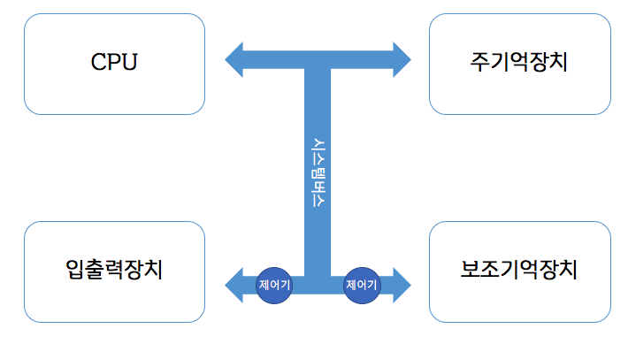

# CHAPTER 01

컴퓨터 시스템의 구조와 각 요소들이 상호작용하는 방법에 대하여 개략적으로 알아보자.

## 컴퓨터 기본 구조

컴퓨터 시스템은 크게 CPU, 주기억장치, 보조기억장치, 입출력장치로 구분할 수 있다.

### CPU

* 프로그램 실행
* 데이터 처리

### 주기억장치

* 전원공급이 끊기면 저장장치 내의 데이터가 사라짐(휘발성)
* 속도가 빠르다
* 가격이 비싸다

### 보조기억장치

* 손상이 되지만 않는다면 영구적으로 데이터를 저장할 수 있다(반영구적)
* 속도가 느리다
* 가격이 싸다

### 입출력장치

* 입력장치: 키보드, 마우스 등
* 출력장치: 모니터, 스피커, 프린터 등

## 컴퓨터의 정보 표현

일반적으로 프로그램은 사람이 이해할 수 있는 고급언어(C언어, Java 등)로 작성된다. 이 고급언어는 CPU가 이해할 수 없기 때문에 컴파일러를 통해 2진 비트로 이루어진 기계어로 변환된다.

고급언어가 기계어로 변환되기 전에 중간다리 역할을 해주는 어셈블리어로 변환이 먼저 이루어지기도 한다. 어셈블리어는 니모닉스라고 불리는 기호로 표현된다.

##### < 알아두면 좋은 데이터 단위표 >

| 10^3^   | 10^6^   | 10^9^   | 10^12^  | 10^15^  |
| ------- | ------- | ------- | ------- | ------- |
| kilo(k) | mega(M) | giga(G) | tera(T) | peta(P) |

| 10^-3^   | 10^-6^     | 10^-9^  | 10^-12^ |
| -------- | ---------- | ------- | ------- |
| milli(m) | micro($u$) | nano(n) | pico(p) |

## 컴퓨터의 정보 처리

word는 CPU가 한 클럭당 처리할 수 있는 비트의 수를 의미하며 CPU는 기계어를 word 단위로 처리한다.

word는 여러개의 필드로 구성되는데 주로 연산필드와 오퍼랜드필드로 이루어진다.

연산필드는 CPU가 수행할 명령어의 종류를, 오퍼랜드필드는 명령어 수행 시 사용할 데이터나 데이터의 주소를 가리킨다.

CPU는 외부장치로 명령어를 전달할 때 3가지 종류의 시스템 버스를 사용한다.

* 주소버스: 주소 정보를 전달
* 데이터버스: 데이터 정보를 전달
* 제어버스: 제어 신호를 전달

## 컴퓨터 시스템

결론적으로 컴퓨터 시스템은 아래 목록들에 대한 기능을 수행한다.

* 프로그램 실행: CPU가 프로그램 코드를 읽어 실행한다.
* 데이터 저장: 프로그램 실행 결과로 얻어진 데이터를 저장한다.
* 데이터 이동: 데이터를 이동시킨다.
* 데이터 입출력: 입출력 장치를 통해 데이터의 입출력을 수행한다.
* 제어: 프로그램 순서를 제어하며 그 외 각종 제어신호를 발생시킨다.

## 예상 질문

시스템버스의 3종류와 각 버스들의 역할에 대해 설명하시오

CPU가 주기억장치에서 시스템버스를 통해 데이터를 불러오는 과정을 설명하시오

CPU가 키보드에서 시스템버스를 통해 데이터를 불러오는 과정을 설명하시오

주기억장치와 보조저장장치를 서로 비교분석하시오