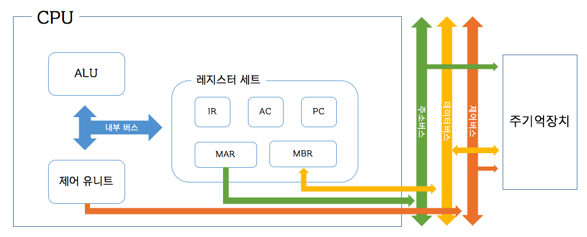

# CHAPTER 02

CPU의 구조와 CPU가 처리하는 명령어에 대해 알아보자.

## CPU의 구조

* ALU: 각종 산술 연산(덧셈, 뺄셈, 곱셈, 나눗셈)들과 논리 연산(AND, OR, NOT, XOR)들을 수행하는 모듈이다.
* 레지스터 세트: CPU 내부에 위치하는 기억장치로 액섹스 속도가 매우 빠르지만 크기가 크다.
  * PC: 다음에 인출될 명령어의 주소를 가지고 있는 레지스터
  * AC: 데이터를 일시적으로 저장하는 레지스터
  * IR: 가장 최근에 인출된 명령어가 저장되어 있는 레지스터
  * MAR: PC에 저장된 명령어 주소가 시스템 주소 버스로 출력되기 전에 일시적으로 저장되는 주소 레지스터
  * MBR: CPU로부터 데이터가 출력되거나 입력할 때 데이터가 일시적으로 저장되는 버퍼 레지스터

* 제어 유니트: 프로그램 명령어를 해석하고 제어 신호들을 발생시키는 모듈이다.

CPU 내부에서는 CPU 내부 버스를 통해 모듈들과 레지스터들 관의 데이터 및 신호가 이동하며, 외부의 시스템 버스와는 버퍼 레지스터나 제어 유니트를 통해 통신한다.

## 명령어 사이클

CPU가 한 개의 명령어를 실행하는 데 필요한 전체 과정을 의미한다.

* 인출 사이클: PC가 가리키는 주소로부터 명령어를 인출해 온다.
* 실행 사이클: CPU가 명령어 코드를 해독하고 필요한 연산을 수행한다.
* 인터럽트 사이클: 현재 실행중인 명령어를 중단하고 다른 프로세스를 처리할 수 있도록 한다. 이러한 프로그램을 ISR이라 하고 인터럽트 발생 시 기존에 수행중이던 프로세스에 대한 정보(레지스터들이 값)를 스택에 저장한다.
* 간접 사이클: 명령어에 주소값이나 데이터가 아니라 참조할 위치를 포함한 경우 실제 주소를 읽어오는 과정이다.

## 명령어 파이프라이닝

하드웨어를 여러 개의 독립적인 단계들로 분할하고, 동시에 서로 다른 명령어들을 처리하도록 함으로써 CPU의 성능을 높여주는 기술을 말한다.

#### 2단계 파이프라이닝

인출단계와 실행단계를 나누어 두 번째 주기부터 인출 단계와 실행 단계를 동시에 수행한다.

| 클록 주기 |  1   |  2   |  3   |  4   |
| :-------: | :--: | :--: | :--: | :--: |
| 명령어 1  | 인출 | 실행 |      |      |
| 명령어 2  |      | 인출 | 실행 |      |
| 명령어 3  |      |      | 인출 | 실행 |

#### 4단계 파이프라이닝

실제로는 인출단계보다 실행단계가 더 오래걸린다. 이로 인하여 발생하는 효율저하를 방지하는 방법은 처리 시간이 더 긴 실행단계를 여러 개로 분할함으로써 단계들의 처리 시작이 거의 같아지도록 하는 것이다.

4단계 분할 예시: 명령어 인출(IF), 명령어 해독(ID), 오퍼랜드 인출(OF), 실행(EX)

| 클록 주기 |  1   |  2   |  3   |  4   |  5   |
| :-------: | :--: | :--: | :--: | :--: | :--: |
| 명령어 1  |  IF  |  ID  |  OF  |  EX  |      |
| 명령어 2  |      |  IF  |  ID  |  OF  |  EX  |
| 명령어 3  |      |      |  IF  |  ID  |  OF  |
| 명령어 4  |      |      |      |  IF  |  ID  |
| 명령어 5  |      |      |      |      |  IF  |

## 슈퍼스칼라

CPU의 처리 속도를 더욱 높이기 위하여 내부에 두 개 이상의 명령어 파이프라인들을 포함시킨 구조를 말한다. 매 클록 주기마다 각 명령어 파이프라인이 별도의 명령어를 인출하여 동시에 실행시킬 수 있다.

## 파이프라이닝의 문제점

파이프라이닝이나 여러 개의 파이프라이닝을 통해 슈퍼스칼라를 구성하는 경우 다음과 같은 이유들로 인하여 성능 저하가 발생하거나 계산 결과에 오류가 발생한다.

* 파이프라이닝을 위해 구분한 단계들에 대하여 모든 명령어가 모든 단계를 거치는 것은 아니다. 명령어 인출 및 해독의 경우 모든 명령어에게 필요한 단계이지만 오퍼랜드 인출의 경우 명령어에 따라 수행하지 않을 수도 있다. 이 때, 파이프라인 하드웨어를 단순화시키기 위해 모든 단계를 수행해야 하므로 필요없는 단계를 수행하는 불필요한 시간을 소모하게 된다.
* 파이프라인 클록은 처리 시간이 가장 오래 걸리는 단계를 기준으로 정해져야 한다. 위의 4단계 파이프라이닝의 클록 2주기를 기준으로 IF가 0.5ns가 걸리고 ID에 0.3ns가 걸린다면, ID는 0.2ns동안 명령어 2의 IF단계가 끝나기를 기다려야 한다.
* 각각의 파이프라인이 기억장치 등 같은 하드웨어에 동시에 접근할 수 없으므로 이를 순차적으로 처리하기 위해 지연시간이 발생한다.
* 데이터 의존성이 발생할 수 있다. 어떤 명령어가 참조하고자 하는 레지스터의 값이 앞에서의 명령어에서 변경이 일어난다고 했을 때, 해당 레지스터의 값이 미리 인출되므로 인해 원하는 결과가 나오지 않을 수도 있다.
* 조건 분기 명령어 혹은 서브 루틴이 실행된다면 미리 인출되어 파이프라인에서 처리되고 있던 명령어들이 무효화될 수 있다. 인터럽트가 들어오는 경우에도 이와 유사한 결과가 나타난다.

## 파이프라이닝의 문제 해결 방안

* 파이프라인의 단계를 더욱 작게 분할함으로써 처리 시간의 차이를 최소화 시킨다.(슈퍼파이프라이닝)
* 최근의 분기 결과들을 저장하여 두는 분기 역사 표 등을 참조하여 분기가 일어날 것인지를 예측한다.

* 조건 분기가 인식되면 분기 명령어의 다음 명령어와 조건이 만족될 경우에 분기하게 될 목적지의 명령어를 함께 인출한다.

* 인출된 명령어들을 버퍼에 저장하고 분기가 발생하면 버퍼 내에 분기하게 될 목적지의 명령어가 있는지를 검사한다.

* 명령어를 멈추거나(stall) 아무것도 하지 않는 명령어를 삽입하거나(bubble) 명령어의 위치를 재배치한다.
* 여분의 레지스터나 하드웨어(메모리, 캐시, ALU 등)를 추가한다.

## 멀티 코어

하나의 칩에 여러개의 CPU 코어 -ALU, 레지스터 세트, 슈퍼스칼라 모듈 등이 갖추진 모듈- 가 있는 것을 말한다.

CPU코어들끼리는 시스템버스와 내부 캐시만 공유하며 독립적으로 실행된다. 

이러한 특성 덕분에 하나의 프로그램에서 여러 개의 명령어를 인출하는 슈퍼스칼라와 달리 독립적인 처리가 가능한 태스크 프로그램들이 동시에 처리될 수 있으며 이를 멀티태스킹이라 한다.

## 멀티 스레드

스레드란 독립적으로 실행될 수 있는 최소 크기의 프로그램 단위를 의미하며 프로세스의 독립적인 흐름을 말하기도 한다.

멀티 스레드에서 스레드는 각가의 프로세서 상태를 저장하기 위해 각각 레지스터 세트(PC, SP, 상태 레지스터, MAR, MBR 등)를 가지며 CPU 코어의 하드웨어 자원들(ALU 등)을 공유한다.

## 명령어

명령어 세트란 CPU가 수행하는 명령어들이 정의되어 있는 집합을 말한다. 명령어 세트를 설계하기 위해서는 아래 사항들을 결정해야 한다.

#### 연산 종류

* 데이터 전송: 레지스터와 기억장치 간에 데이터를 이동하는 동작
* 산술 연산: 덕셈, 뺄셈, 곱셈 및 나눗셈과 같은 기본적인 산술 연산
* 논리 연산: AND, OR, NOT,  XOR
* 입출력: 입출력 장치와의 데이터 이동
* 제어: 명령어 실행 순서를 변경하는 연산. 분기나 서브루틴 등이 있다.

#### 데이터 유형

3장에서 설명

#### 명령어 형식

* 0-주소 명령어: 스택 이용
* 1-주소 명령어: AC와 계산 후 AC에 저장
* 2-주소 명령어: 가장 일반적인 명령어 형식
* 3-주소 명령어: 명령 인출을 위한 주기억장치 접근횟수가 줄어든다

#### 주소지정 방식

M[A]: 주기억장치에서 A주소의 값, OF: 오퍼랜드 필드의 값, R[A]: 레지스터 번호가 A인 레지스터의 값

* 직접 주소지정 방식: 데이터 = M[OF]
* 간접 주소지정 방식: 데이터 = M[M[OF]]
* 묵시적 주소지정 방식: AC 등 이미 오퍼랜드 필드가 정해져 있음
* 즉시 주소지정 방식: 데이터 = OF
* 레지스터 주소지정 방식: 데이터 = R[OF]
* 레지스터 간접 주소지정 방식 = M[R[OF]]
* 변위 주소지정 방식
  * 상대 주소지정 방식: PC + A, 분기 처리에 사용한다
  * 인덱스 주소지정 방식: A + IX, 배열 인덱싱에 사용한다
  * 베이스-레지스터 주소지정 방식: BR + A, BR에는 프로그램 시작 주소가 담긴다

## 예상 질문

CPU 내부의 레지스터 세트에는 어떠한 레지스터들이 존재하는가?

인터럽트 사이클이 발생할 때, CPU에 있던 레지스터 정보들을 어디에 저장하는가?

CPU의 명령어를 4단계 파이프 라이닝으로 처리하면 이론적으론 최대 4배까지 속도향상이 가능하다. 실제적으로 4배까지 속도향상이 되지 않는 이유에 대해 설명하시오

4단계 파이프 라이닝에서 각 단계의 처리속도가 100ns, 150ns, 150ns, 300ns라고 하자. 클록 당 처리속도는 몇ns로 결정해야 하는가?

슈퍼스칼라 구조의 경우 발생하는 문제와 이를 해결하기 위한 방안에 대해 설명하시오

멀티 코어 환경에서 CPU 코어 간 공유하는 것과 공유하지 않는 것들이 무엇인지 설명하시오

멀티 코어 환경에서 하나의 독립적인 태스크로 이루어진 프로그램을 처리하는 경우에 싱글 코어 환경에 비하여 처리 시간을 별로 단축시키지 못하는 이유와 멀티 코어 환경에서 성능 향상을 얻을 수 있는 경우는 어떤 프로그램 처리 환경인지 설명하라

 

