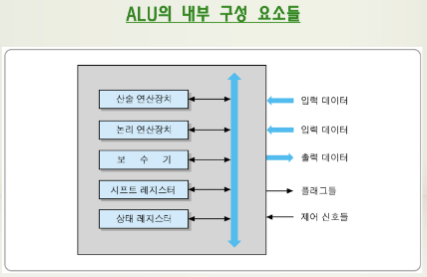
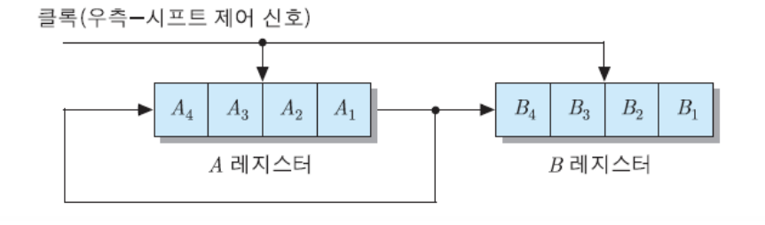
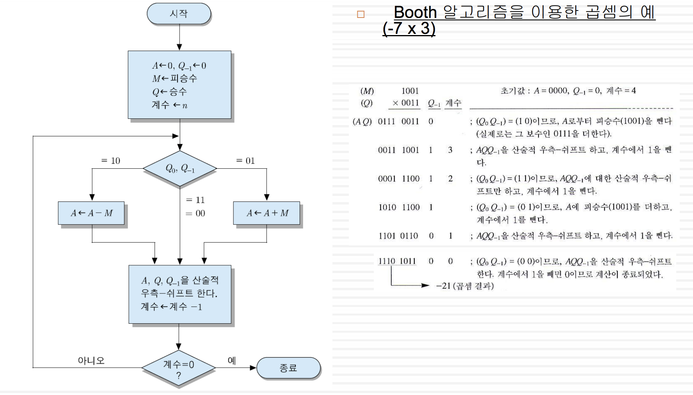

## ALU의 구성요소

**산술 연산장치** : 산술 연산들을 수행

**논리 연산장치** : 논리 연산들(AND, OR, XOR, NOT 등) 을 수행

**시프트 레지스터** : 비트들을 좌측 혹은 우측으로 이동싴니느 기능을 가진 레스터

**보수기** : 2진 데이터를 2의 보수로 변환(음수화)

**상태 레지스터** : 연산 결과의 상태를 나타내는 플래그(flag)들을 저장하는 레지스터

> ALU의 내부 구성 요소들

## 음수의 표현

#### 음수 표현 방법

- 부호화-크기 표현
- 1의 보수 표현
- 2의 보수 표현

## 부호화-크기 표현

**맨 좌측 비트는 부호, 나머지 n-1개의 비트들은 수의 크기를 나타낸다**

> +9 = 0 0001001
>
> -9 = 1 0001001

**결점**

- 덧셈과 뺄셈을 수행하려면 부호 비트와 크기 부분 별도로 계산해야 함
- 0에대한 표현 2개 존재

> n비트 단어로 표현할수 있는 수 $2^n-1$ 

## 보수 표현

#### 1의 보수 표현

- 모든 비트들을 반전

#### 2의 보수 표현

- 모든 비트들을 반전 후, 결과값에 1을 더함

## 비트 확장

**데이터의 길이(비트 수)를 늘리는 방법**

- 데이터를 더 많은 비트의 레지스터에저장하거나 더 긴 데이터와 연산 수행하기 위한 목적

**부호화-크기표현의 경우**

- 부호비트유지
- 0 삽입

**2의 보수 표현의 경우**

- 확장되는 상위 비트들을 부호 비트와 같은 값으로 확장

  > 부호-비트 확장이라고 한다
  >
  > +21 = 0010101 (8비트 2의 보수)
  >
  > +21 = 000000000010101 (16비트 2의 보수)

## 논리 연산

#### 기본적인 논리 연산

| A B  | NOT A | NOT B | A AND B | A OR B | A XOR B |
| ---- | ----- | ----- | ------- | ------ | ------- |
| 0 0  | 1     | 1     | 0       | 0      | 0       |
| 0 1  | 1     | 0     | 0       | 1      | 1       |
| 1 0  | 0     | 1     | 0       | 1      | 1       |
| 1 1  | 0     | 0     | 1       | 1      | 0       |

#### N비트 논리연산

- AND 연산 : 두 데이터 단어들의 대응되는 비트들 간 AND 연산
- OR 연산 : 두 데이터 단어들의 대응되는 비트들 간 OR 연산
- XOR 연산 : 두 데이터 단어들의 대응되는 비트들 간 exclusive-OR 연산
- NOT 연산 : 데이터 단어의 모든 비트들 반전

#### 논리연산의 응용

- 선택적-세트 연산 : B레지스터의 비트들 중 1로 세트된 비트들과 같은 위치에 있는 A 레지스터의 비트들을 1로 세트(OR연산)
- 선택적-보수 연산 : B 레지스터의 비트들 중에서 1로 세트 된 비트들에 대응되는 A 레지스터의 비트들을 보수로 변환(XOR연산)
- 마스크 연산 : B 레지스터의 비트들 중에서 값이 0인 비트들과 같은 위치에 있는
  A 레지스터의 비트들을 0으로 바꿈
- 삽입 연산 : 새로운 비트 값들을 데이터 단어내의 특정 위치에 삽입
  - 삽입할 비트 위치들에 대해 마스크 연산 수행
  - 새로 삽입할 비트와 OR 연산 수행

- 비교 연산

  - A와 B 레지스터의 내용 비교
  - 대응되는 비트 값이 같으면, A 레지스터의 해당 비트 0으로 세트
  - 서로 다르면, A 레지스터의 해당 비트 1로 세트
  - 모든 비트들이 같으면, Z플래그를 1로 세트

  > 제로 플래그 : 상태 레지스터 플래그의 일종으로,  연산 결과가 0이면 참이 된다

## 시프트 연산

**논리적 시프트** : 레지스터 내의 데이터 비트들을 왼쪽 혹은 오른쪽으로 한 칸씩 이동하는 연산

- **좌측 시프트 **: 모든 비트들을 좌촉으로 한 칸씩 이동, 최하위 비트는 0이 들어오고, 최상위 비트는 버림

- **우측 시프트** : 모든 비트들이 우측으로 한 칸씩 이동, 최상위 비트로는 0이 들어오고, 최하위 비트는 버림

**순환 시프트** : 최상위 혹은 최하위 비트를 버리지 않고, 반대편 끝에 있는 비트 위치로 이동

- **순환 좌측 시프트** : 최상위 비트가 최하위 비트 위치로 이동
- **순환 우측 시프트** : 최하위 비트가 최상위 비트 위치로 이동

**직렬 데이터 전송** : 시프트 연산을 데이터 비트 수만큼 연속적으로 수행하여 두 레지스터들 사이에 한 개의 선을 통하여 전체 데이터를 이동하는 동작

**산술적 시프트** : 부호있는 수를 나타내는 데이터에 대한 시프트

- 부호 비트는 그대로 유지하고, 수의 크기를 나타내는 비트들만 시프트
- 산술적 좌측 시프트 
- 산술적 우측 시프트

**C 플래그를 포함한 시프트 연산 **

- C플래그를 포함한 좌측 시프트 연산(SHLC)
- C플래그를 포함한 우측 시프트 연산(SHRC)

**C 플래그를 포함한 순환 시프트 연산 **

- C플래그를 포함한 좌측 순환 시프트 연산(RLC)
- C플래그를 포함한 우측 순환 시프트 연산(RRC)

## 정수의 산술연산

#### 덧셈

- 2의 보수로 표현된 수들의 덧셈 방법 : 두 수를 더하고, 올림수 발생하면 버림

#### 병렬 가산기

- 덧셈을 수행하는 하드웨어 모듈
- 비트 수만큼 전가산기들로 구성
- 덧셈 연산결과에 따라 해당 플래그들 세트
  - C 플래그 : 올림수
  - S 플래그 : 부호
  - Z 플래그 : 0
  - V 플래그 : 오버플로우

**덧셈 오버플로우** : 덧셈 결과가 범위를 초과하여 결과값이 틀리게 되는 상태

> 두 올림수들 간 exclusive-OR 이용

#### 뺼셈

- 덧셈을 이용하여 수행

  > A - B = A + (-B)

**뺼셈 오버플로우** : 뺄셈 결과가 그 범위를 초과하여 결과값이 틀리게 되는 상태

#### 부호 없는 정수의 곱셈

- 각 비트에 대하여 부분 적 계산
- 부분적 모두 더하여 결과 얻을 수 있음

#### 2의 보수들 간의 곱셈

- Booth 알고리즘 사용

## 부동소수점 수의 표현

**소수점의 위치를 이동시킬 수 있는 수 표현 방법**

**일반적인 형태 :**

- $ N = (-1)^S M * B^E$

  > S : 부호
  >
  > M : 가수
  >
  > B : 기수
  >
  > E : 지수

**2진 부동소수점 수**

- 기수 : 2
- 단일정밀도 부동소수점 수 : 32비트, 부호 부분1, 지수 부분 8, 가수 부분 23개로 비트를 할당
- 복수정밀도 부동소수점 수 : 64비트, 부호 부분 1, 지수 부분 11, 가수 부분 52개로 비트를 할당

**실수를 부동 소수점 방식으로 저장하는 과정**

- 실수를 부동 소수점 방식으로 저장할 때는 정규화 과정을 거침

  > $101.01 * 2^1$ -> $1.0101 * 2^3$

- 양의 지수와 음의 지수가 구분되도록 단일 정밀도에서는 지수에 127을 더하고 복수 정밀도에서는 1023을 더함. 가수에는 정수 값 1을 생략하고 저장.

  > 2진수 10110.11011
  >
  > 정규화 -> $1.011011011 * 2^4$ 
  >
  > 부호비트 양수 -> 0, 지수 4이므로, 바이어스에 적용하면 127 + 4 =.131
  >
  > 가수는 정수 값 1을 제외한 011011011을 저장하고 나머지 0을 채움
  >
  > 결과 : 0 10000011 00000000000000011011011

**부동 소수점 표현 방식은 IEEE 방식과 IBM 방식으로 나누어짐, 요즘은 IEEE 방식이 쓰임**

## 부동소수점의 산술연산

**덧셈과 뺄셈**

- 지수를 같게 조정하고, 덧셈과 뺼셈을 실행한다
- 계산 결과 가수를 정규화 한다
- 이에 맞게 지수값 조절

**곱셈**

- 지수를 같게 조정하지 않는다.
- 가수끼리 곱한다.
- 지수끼리 더한다.
- 소수이하 자리는 정해진 자리에서 반올림 한다

**나눗셈**

- 지수를 같게 조정하지 않는다
- 가수끼리 나눈다
- 지수끼리 뺀다
- 소수이하자리는 정해진 자리에서 반올림 한다
- 계산 결과 가수를 정규화 한다