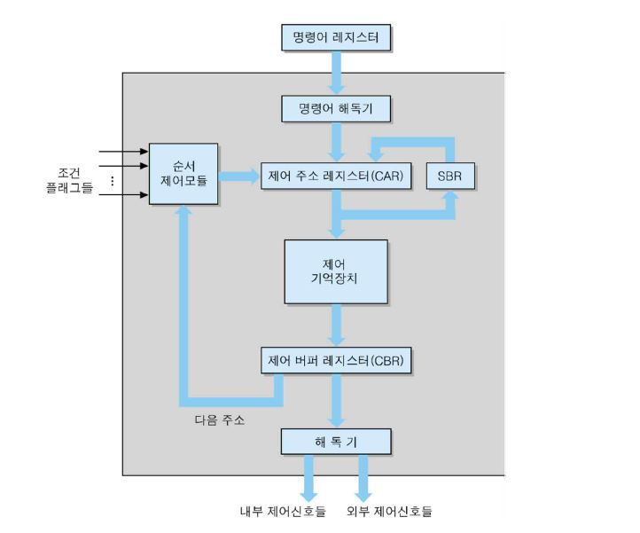
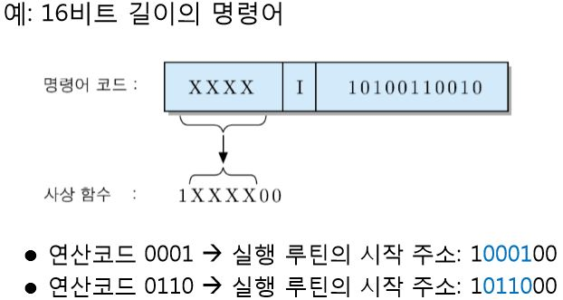
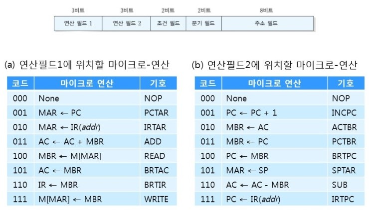
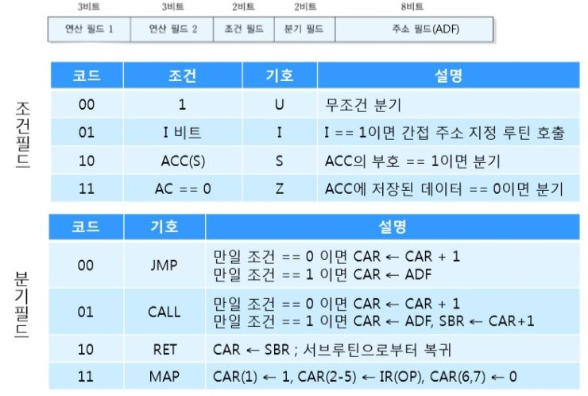
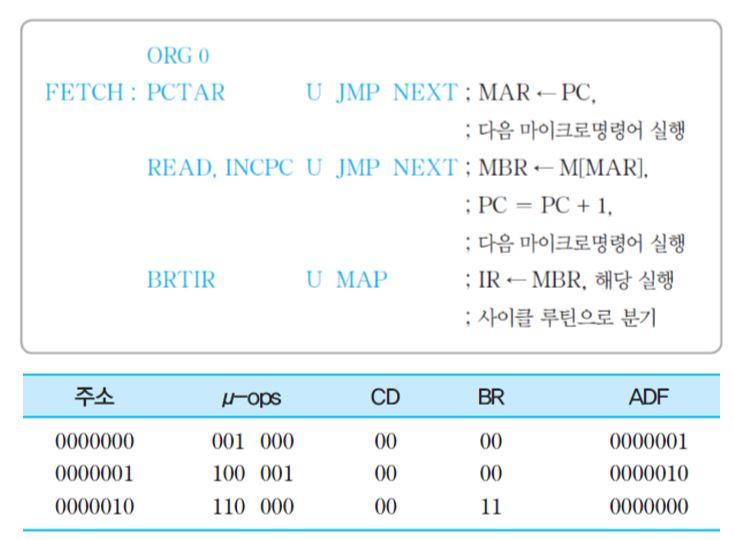
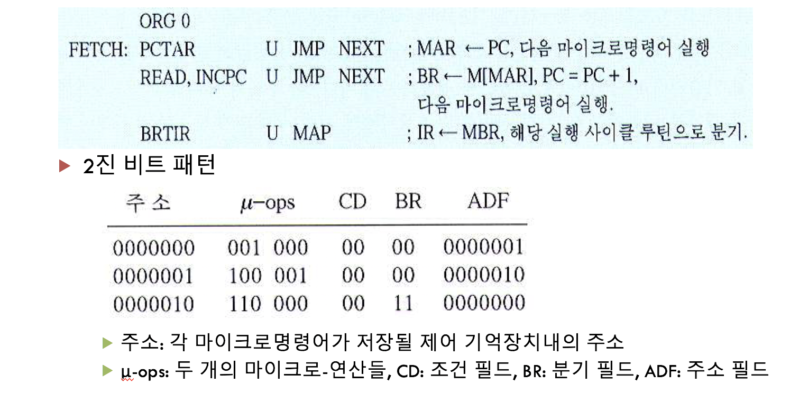

# 제어 유니트

## 제어 유니트의 기능

명령어 코드의 해독, 명령어 실행에 필요한 제어 신호들 발생

**마이크로명령어** : 명령어 사이클의 각 주기에서 실행되는 마이크로-연산들에 대응되는 비트들로 이루어진 단어, 제어단어라고도 함

**마이크로프로그램 ** : 마이크로명령어들의 집합

**루틴** : CPU의 특정 기능을 수행하기 위한 마이크로 명령어들의 그룹

> 인출 사이클 루틴, 실행 사이클 루틴 등

## 제어 유니트의 구조

**명령어 해독기(instruction decoder)** : „명령어 레지스터(IR)로부터 들어오는 명령어의 연산 코드를 해독하여 해당 연산을 수행하기 위한 루틴의 시작 주소를 결정

**제어 주소 레지스터(CAR)** : „다음에 실행할 마이크로명령어의 주소를 저장하는 레지스터, „이 주소는 제어 기억장치의 특정 위치를 지칭 

**제어 기억장치(control memory)** : „마이크로명령어들로 이루어진 마이크로프로그램을 저장하는 내부 기억장치

**제어 버퍼 레지스터(CBR)** : „제어 기억장치로부터 읽혀진 마이크로명령어 비트들을 일시적으로 저장하는 레지스터

**서브루틴 레지스터(SBR)** : „마이크로프로그램에서서브루틴이 호출되는 경우에 현재의 CAR 내용을 일시적으로 저장하는 레지스터

**순서제어 모듈(sequencing module)** : „마이크로명령어의 실행 순서를 결정하는 회로들의 집합

#### „CPU 명령어 세트 설계 과정

- „명령어들의 종류와 비트 패턴 정의

- „명령어들의 실행에 필요한 하드웨어 설계

- „각 명령어를 위한 실행 사이클 루틴 작성(마이크로프로그래밍) 한다.
- „마이크로프로그램 코드들을 제어 기억장치에 저장

#### „CPU 제어 유니트의 명령어 해독 과정

**명령어 해독** :  연산 코드를 이용하여 연산을 위한 실행 사이클 루틴의 시작 주소를 찾는 과정

- 사상(mapping)을 이용하는 방식
  - 명령어의 연산코드를 이용하여 해당 사이클 루틴의 시작 주소를 찾는 기법
  - 명령어의 연산코드를 특정 비트 패턴과 혼합시켜 연산의 수행에 필요한 실행 사이클 루틴의 시작 주소 찾아냄

## 마이크로 명령어의 형식

**„연산 필드** :  실행할 마이크로-연산의 종류를 지정

> 연산 필드가 2개인 이유 : 마이크로 연산을 2개 동시에 수행하기 위함!

„**조건 필드** :  분기에 사용될 조건 플래그를 지정

„**분기 필드** :  분기의 종류와 다음에 실행할 마이크로명령어의 주소를 결정하는 방법을 명시

„**주소 필드** :  내용은 분기가 발생하는 경우에 목적지 마이크로명령어의 주소로 사용

#### 연산 필드에 위치할 마이크로 연산

#### 조건,분기 필드에 위치할 마이크로 연산

## 마이크로프로그래밍

#### 인출 사이클 루틴

**ORG** : 오리진의 약자, 어디서 시작하는지를 나타내는 어셈블리어 

#### 간접 사이클 루틴

#### 실행 사이클 루틴

- „CPU 명령어는 서로 다른 실행 사이클 루틴을 갖는다
- „사상 방식을 이용하여 CPU 명령어의 연산 코드에 대한 실행 사이클 루틴의 시작 주소를 결정하고, 그 루틴을 실행하여 CPU 명령어를 실행한다

## 마이크로프로그램의 순서제어

#### 수직적 마이크로프로그래밍

- „마이크로명령어의 연산 필드에 적은 수의 코드화된(encoded) 비트들을 포함시킴으로써 제어 기억장치의 용량을 줄이고, 해독기를 이용하여 그 코드를 필요한 수 만큼의 제어 신호들로 확장하는 방식
- 마이크로명령어의 비트 수가 감소
- 해독 시간만큼의 지연 시간이 발생

#### 수평적 마이크로프로그래밍

- „연산 필드의 각 비트와 제어 신호를 일대일로 대응시켜서, 그 수만큼의 비트들로 이루어진 마이크로명령어들을 사용하는 방식
- 하드웨어가 간단하고, 해독에 따른 지연 시간이 없음
- 마이크로명령어 비트 수가 길기 때문에 더 큰 용량의 제어 기억장치가 필요

