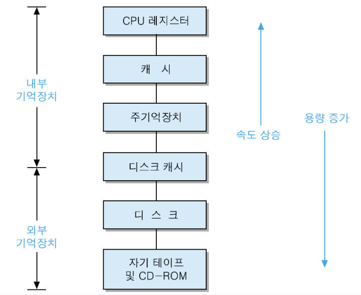
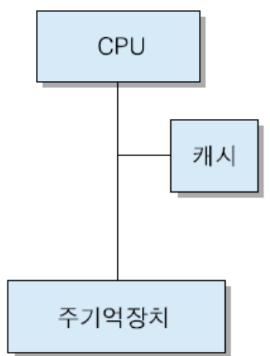

# 기억장치

## 기억장치의 분류와 특성

**내부 기억장치 ** : CPU가 직접 액세스 할 수 있는 장치

**외부 기억장치** : 장치 제어기를 통해 액세스 할 수 있는 장치

**컴퓨터시스템**은 프로그램과 데이터를 저장하기 위해 기억장치를 가지고 있음

**기억장치 액세스 **: 기억장치에 어떤 정보를 쓰거나 읽는 동작

> 제조 공정과 재료 및 조직에 따라 액세스 방법이 달라짐! 
>
> 4가지로 분류

#### 액세스 방법에 따른 기억장치의 종류

**순차적 액세스(sequential access)** : 저장된 정보를 처음부터 순서대로 액세스하는 방식 (예: 자기 테이프)

**직접 액세스(direct access)** : 액세스할 위치 근처로 직접 이동한 다음에, 순차적 검색을 통하여 최종 위치에 도달 는 방식 (예: 디스크, CD-ROM)

**임의 액세스(random access)** : 주소에 의해 직접 기억장소를 찾아 액세스하며, 어떤 기억 장소든 액세스하는 시 이 동일 (예: 반도체 기억장치)

**연관 액세스(associative access)** : 저장된 내용의 특정 비트들을 비교하여, 일치하는 내용을 액세스 (예: 연관 기억장치(associative memory))

## 계층적 기억장치시스템

- „다양한 종류의 기억장치를 계층적으로 배치하여 하나의 기억장치를 구성한 기억장치 시스템
- „기억장치의 접근속도, 용량 그리고 비용 등을 고려하여 비용대비 성능을 최적화
- „가상기억장치(Virtual Memory) 등을 지원하기 위한 기반 구조

**필요성** : 기억장치들은 속도, 용량 및 가격 측면에서 매우 다양하며, 적절한 성능(속도), 용량 및 가격의 기억장치 구성필요

**효과** : 기억장치시스템의 성능 대 가격비(performance/cost ratio) 향상

#### 기억장치 계층

상위 층으로 갈수록 비트당 가격이 높아지고, 용량이 감소하며, 액세스 시간은 짧아지고, CPU에 의한 액세스 빈도는 높아진다

## 반도체 기억장치

#### RAM

- „임의 액세스 방식 
- „반도체 집적회로 기억장치(semiconductor IC memory)
- „데이터 읽기와 쓰기가 모두 가능 
- „휘발성 : 전원 공급이 중단되면 내용이 지워짐

#### ROM

- 영구 저장이 가능한 반도체 기억장치

- „읽는 것만 가능하고, 쓰는 것은 불가능

- „다음 내용들의 저장에 사용

  - „시스템 초기화 및 진단 프로그램 (예: PC의 BIOS 프로그램)

  - „빈번히 사용되는 함수들을 위한 서브루틴들

  - „제어 유니트의 마이크로프로그램

## 기억장치 모듈의 설계

**기억장치 칩의 데이터 비트 수가 단어 길이보다 짧은 경우**

- 여러 개의 칩들을 병렬로 접속한 기억장치 모듈로 구성

**„필요한 기억장치 용량이 각 기억장치 칩의 용량보다 큰 경우**

- 여러 개의 칩들을 직렬로 접속하여 기억장치 모듈을 구성

**„기억장치 모듈의 설계 순서**

1. 컴퓨터시스템에 필요한 기억장치 용량 결정

2. 사용할 칩들을 결정하고, 주소 표(address table 혹은 address map)를 작성

3. 세부 회로 설계

## 캐시 메모리

****

**사용 목적 : **CPU와 주기억장치의 속도 차이로 인한 CPU 대기 시간을 최소화 시키기 위하여 CPU와 주기억장치 사 이에 설치하는 고속 반도체 기억장치

**특징**

- 주기억장치보다 액세스 속도가 높은 칩 사용
- 가격 및 제한된 공간 때문에 용량이 적다

**캐시 적중(cache hit)** : CPU가 원하는 데이터가 캐시에 있는 상태
**캐시 미스(cache miss)** : CPU가 원하는 데이터가 캐시에 없는 상태. 이 경우에는 주기억 장치로부터 데이터를 읽어온다.
**적중률(hit ratio)** : 캐시에 적중되는 정도(H)

> 캐시의 적중률이 높아질수록 평균 기억장치 액세스시간은 캐시 액세스 시간에 접근
> 캐시 적중률은 프로그램과 데이터의 지역성(locality)에 따라 달라짐

#### 지역성

**시간적 지역성(temporal locality)** : 최근에 액세스된 프로그램이나 데이터가 가까운
미래에 다시 액세스 될 가능성이 높다
**공간적 지역성(spatial locality)** : 기억장치내에 인접하여 저장되어 있는 데이터들이
연속적으로 액세스 될 가능성이 높다
**순차적 지역성(sequential locality)** : 분기(branch)가 발생하지 않는 한, 명령어들은 기
억장치에 저장된 순서대로 인출되어 실행된다

#### 캐시의 용량

- 용량이 커질수록 적중률이 높아지지만, 비용이 증가
- 용량이 커질수록 주소 해독 및 정보 인출을 위한 주변 회로가 더 복잡해지기 때문에 액세스 시간이 다소 더 길어진다

#### 인출 방식

**요구 인출(demand fetch) 방식** : 필요한 정보만 인출해 오는 방법
**선인출(prefetch) 방식**

- 필요한 정보 외에 앞으로 필요할 것으로 예측되는 정보도 미리 인출
- 지역성이 높은 경우에 효과가 높다.

#### 사상 방식

어떤 주기억장치 블록들이 어느 캐시 라인을 공유할지를 결정해 주는 방법

**직접 사상** : 주기억장치의 블록들이 지정된 하나의 캐시 라인으로만 적재됨

**완전-연관 사상** : 주기억장치 블록이 캐시의 어떤 라인으로든 적재 가능

**세트-연관 사상**

- 직접 사상과 완전-연관 사상의 조합
- 주기억장치 블록 그룹이 하나의 캐시. 세트를 공유하며, 그 세트에는 두 개 이상의 라인들이 적재될 수 있음
- 캐시는 v 개의 세트(set)들로 나누어지며, 각. 세트들은 k 개의 라인들로 구성 ( k-way 세트-연관 사상 이라고 부름)

#### 교체 알고리즘

세트-연관 사상에서 주기억장치로부터 새로운 블록이 캐시로 적재될 때, 만약 세트 내 모든 라인들이 다른 블록들로 채워져 있다면, 그들 중 하나를 선택하여 새로운 블록으로 교체

**캐시 적중률을 극대화할 수 있도록 교체할 블록을 선택하기 위한 알고리즘**

**최소 최근 사용(LRU) 알고리즘** : 사용되지 않은채로 가장 오래 있었던 블록을 교체하는 방식

**FIFO(FIFO) 알고리즘** : 캐시에 적재된 지 가장 오래된 블록을 교체하는 방식

**최소 사용 빈도(LFU) 알고리즘** : 참조되었던 횟수가 가장 적은 블록을 교체하는 방식

#### 쓰기 정책

캐시의 블록이 변경되었을 때 그 내용을 주기억장치에 갱신하는 시기와 방법의 결정

**Write-through** : 모든 쓰기 동작들이 캐시로 뿐만 아니라 주기억장치로도 동시에 수행되는 방식

**Write-back** : 캐시에서 데이터가 변경되어도 주기억장치에는 갱신되지 않는 방식

#### 다중 캐시

**온-칩 캐시** : 캐시 액세스 시간을 단축시키기 위하여 CPU 칩 내에 포함시킨 캐시

**계층적 캐시** : 온-칩 캐시를 1차 캐시로 사용하고, 칩 외부에 더 큰 용량의 2차 캐시를 설치하는 방식

**분리 캐시**

- 캐시를 명령어 캐시와 데이터 캐시로 분리
- 명령어 인출 유니트와 실행 유니트. 간의 캐시 액세스 충돌 제거
- 대부분의 고속 프로세서들에서 사용

#### 

## 최신 기억장치 기술

#### SDRAM

**동기식 DRAM** : 액세스 동작들이 시스템 클록에 맞추어 수행되는 DRAM

#### DDR SDRAM

- 기억장치 대역폭을 향상시키기 위한 기술

  > 대역폭 : 단위 시간 당 전송되는 데이터 량

- DDR SDRAM : 버스 클록 당 두 번의 데이터 전송

- DDR2 SDRAM : DDR SDRAM과 같으며, 버스 클록 주파수 두배 높여 대역폭을 향상

#### 기억장치 랭크

- 데이터 입출력 폭이 64비트가 되도록 구성한 기억장치 모듈
- x4 혹은 x8 조직의 칩들을 여러 개 사용하여 데이터 입출력 폭이 64비트가 되게 함

**단일랭크 모듈** : x8 조직의 SDRAM 8개를 병렬접속 하여 하나의 랭클르 구성하면서, 64비트 데이터가 버스를 통하여 전송되도록 구성한 기억장치 모듈

**2중랭크 모듈** : x8 조직의 SDRAM들을 각 면에 8개씩 병렬접속하여 두 개의 랭크로 구성된 기억장치 모듈

**4중랭크 모듈**: x16 조직의 SDRAM 칩들 이용, 면당 두 랭크씩으로 구성

## 차세대 비휘발성 기억장치

**PRAM** : 상태가 변하는 특수 물질을 이용하여 제조한 RAM, 인가되는 전류의 세기에 따라 내부 구조가 변하여 저항이 약한 고체 상태 혹은 저항이 낮은 액체 상태가 됨

> 물질 : 게르마늄 안티몬 텔룰라이드(GST)

**FeRAM** : 강유전체의 특성을 이용하는 반도체 기억장치

> 강유전체 : 전기를 인가하지 않은 자연 상태에서도 전기적 극성을 띄고 있는 물질

**MRAM** : 자기장을 이용하여 정보를 저장하는 반도체 기억장치

- 강자성체에 가해지는 자기장의 방향으로 자화되며, 자기장이 제거되어도 자성이 그대로 유지